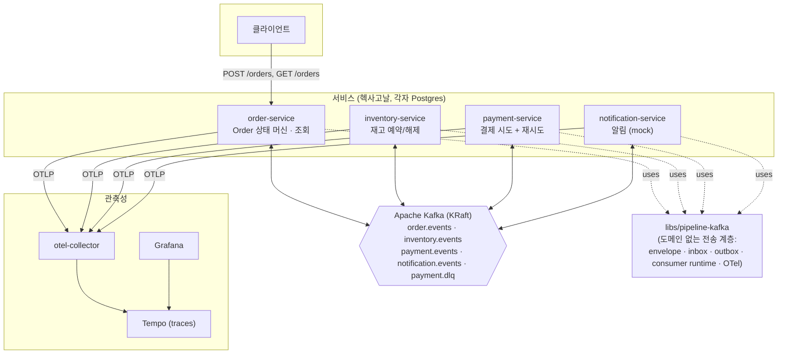
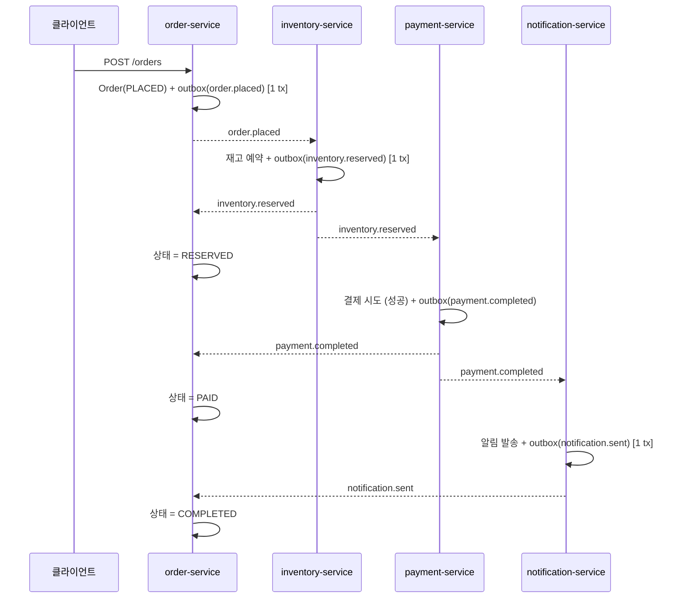
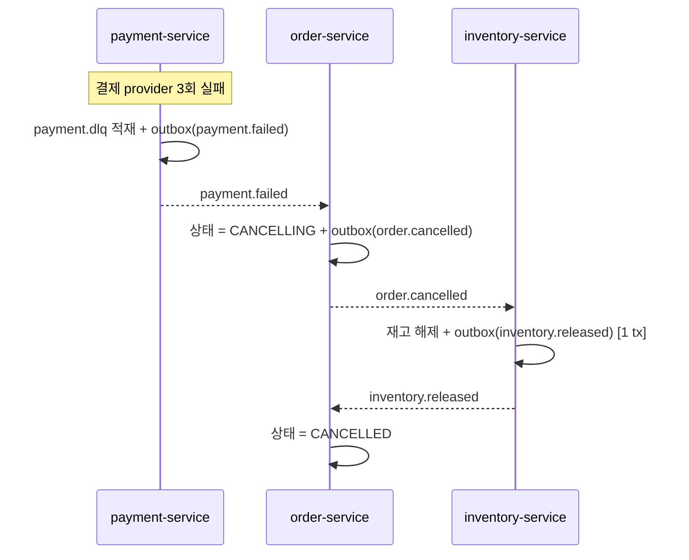

# order-pipeline-choreography

Kafka 기반 비동기 주문 처리 시스템 — **Choreography(코레오그래피) 방식** 학습 프로젝트. 백엔드 전용.

선행 프로젝트 [`../order-pipeline`](../order-pipeline)(Saga **Orchestration**)의 후속. 같은 도메인을
중앙 조정자 없이 다시 구현한다.

---

## 목표

| # | 목표 | 왜 |
|---|---|---|
| 1 | **at-least-once 전달 보장을 제대로 구현** | 선행 프로젝트는 `enable.auto.commit`이 켜진 채라 크래시 타이밍에 따라 메시지 유실·중복 → 재고 이중 차감. 이번엔 **수동 커밋 + 멱등 컨슈머(inbox) + transactional outbox**로 정면 대응 |
| 2 | **Choreography 실습** | 중앙 오케스트레이터 없이, 각 서비스가 다른 서비스의 도메인 이벤트에 **반응**해서 전체 흐름이 진행 |
| 3 | **Kafka 메시징 복습** | 컨슈머 그룹, 파티션, 키잉, 리밸런스, 스키마 계약, 수동 오프셋 |
| 4 | **실무형 구조 + 풀 관측성** | 헥사고날 아키텍처, OpenTelemetry + Tempo/Prometheus/Loki/Grafana |

---

## 무엇을 하는가

주문 하나가 **재고 예약 → 결제 → 알림**을 거쳐 완료된다. 중간에 실패하면 **보상 트랜잭션**으로
되돌린다.

- **재고 부족**: 재시도해도 결과가 같으므로 즉시 취소 (보상 불필요)
- **결제 실패**: 일시적 오류로 보고 최대 3회 재시도. 소진되면 `payment.dlq`에 적재하고 재고를 되돌림

주문 상태는 `order-service`가 자기 DB에 유지한다. 다른 서비스들이 발행하는 이벤트
(`inventory.reserved`, `payment.completed` ...)를 구독해 상태를 전진시키고, `GET /orders/{id}`로 조회한다.

---

## 아키텍처



- **서비스 간 비즈니스 코드 공유 없음.** 공유하는 것은 도메인 지식이 0인 전송 라이브러리 `pipeline-kafka`뿐.
- 메시지 계약은 `contracts/`의 JSON Schema로만 합의. 각 서비스는 자기 Pydantic 모델을 정의.
- 토픽은 애그리거트당 1개. 파티션 3, `key = order_id` (주문별 순서 보장).

---

## 주요 Flow

### 해피패스



### 결제 실패 + 보상



---

## at-least-once 핵심

모든 소비 핸들러는 **단일 DB 트랜잭션** 안에서 ① inbox 중복 체크 → ② 도메인 상태 변경 →
③ 결과 이벤트 outbox 삽입 을 하고, **트랜잭션 커밋 성공 후에만** Kafka 오프셋을 수동 커밋한다.

```
consumer.poll()
 → BEGIN tx
     INSERT inbox(message_id, consumer_group)   -- PK 충돌 = 중복 → 도메인 skip
     도메인 로직 (repo write)
     INSERT outbox(...)                          -- 결과 이벤트
   COMMIT tx
 → consumer.commit(message)                      -- 오프셋, tx 밖
```

- **outbox**: 도메인 write와 이벤트 발행이 같은 트랜잭션 → dual write 없음. 별도 폴러가
  `published_at IS NULL` 행을 읽어 Kafka에 발행.
- **inbox**: `(message_id, consumer_group)` PK. 재전달돼도 효과는 1회.
- 결과: at-least-once **전달** + 멱등 **효과** = 효과적 exactly-once.

Kafka 트랜잭션/EOS는 **일부러 안 쓴다** — 멱등 컨슈머를 직접 구현하는 게 학습 목표.

---

## 관측성

각 서비스가 OTel SDK로 OTLP를 `otel-collector`에 보내고, collector가 백엔드로 분배한다.

| 신호 | 백엔드 | 상태 |
|---|---|---|
| traces | Tempo | ✅ 인프라 준비 (계측은 진행 중) |
| metrics | Prometheus | Slice 4 |
| logs | Loki (Promtail 경유) | Slice 4 |

Grafana가 단일 창. 한 주문의 `order.placed → inventory.reserved → payment.completed → notification.sent`가
하나의 인과 트레이스로 이어진다.

---

## 진행 상태

**Slice 0 — 워킹 스켈레톤 (발행 경로).** 14개 덩어리 중 2개 완료.

| 덩어리 | 상태 |
|---|---|
| 1. uv workspace 뼈대 | ✅ |
| 2. docker-compose 인프라 (kafka, kafka-ui, postgres, tempo, otel-collector, grafana) | ✅ |
| 3. `contracts/order.placed.json` | ✅ |
| 4. pipeline-kafka: envelope 모델 + 직렬화 | ✅ |
| 5. pipeline-kafka: OTel 배선 (트레이스 전파) | ✅ |
| 6. pipeline-kafka: producer 래퍼 | ▶ 진행 중 |
| 7–13. pipeline-kafka(outbox) + order-service (도메인, FastAPI, alembic ...) | |
| 14. 통합 테스트 | |

이후 Slice 1(컨슈머 + inventory) → 2(payment) → 3(보상 + notification) → 4(관측성 풀) → 5(크래시 주입 테스트).

상세 설계: [`docs/specs_plans/2026-09-08-order-pipeline-choreography-design.md`](docs/specs_plans/2026-09-08-order-pipeline-choreography-design.md)
Slice 0 계획: [`docs/specs_plans/2026-09-08-slice-0-plan.md`](docs/specs_plans/2026-09-08-slice-0-plan.md)

---

## 로컬 실행

```bash
# 인프라 기동
docker compose up -d
docker compose ps          # kafka-init은 Exited(0)이 정상, 나머지는 Up

# 확인
open http://localhost:8080   # kafka-ui — 토픽/파티션/메시지
open http://localhost:3000   # Grafana — 트레이스 (로그인 불필요)

# 정지 (데이터 유지)
docker compose stop
# 완전 삭제 (볼륨까지)
docker compose down -v
```

| 포트 | 서비스 |
|---|---|
| 9092 | Kafka (호스트에서 접속) |
| 8080 | kafka-ui |
| 5432 | order-postgres |
| 3000 | Grafana |
| 3200 | Tempo |
| 4317 / 4318 | otel-collector (OTLP gRPC / HTTP) |

---

## 기술 스택

Python 3.12 · uv workspace · FastAPI · SQLAlchemy 2.0 (async) · asyncpg · Alembic ·
confluent-kafka · Apache Kafka (KRaft) · OpenTelemetry · Tempo/Grafana · Docker Compose · pytest
