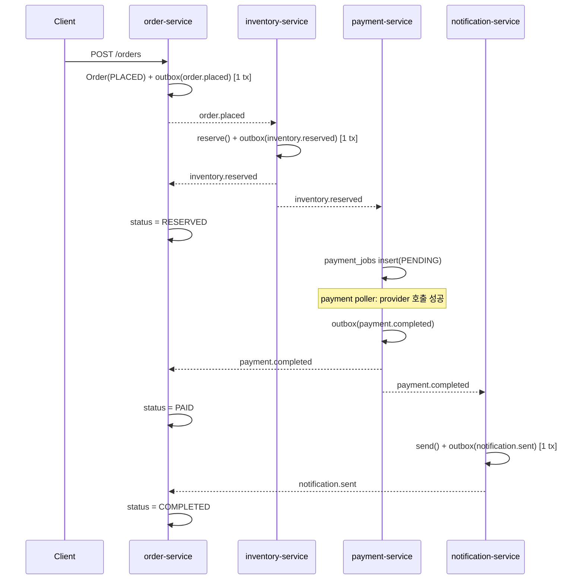
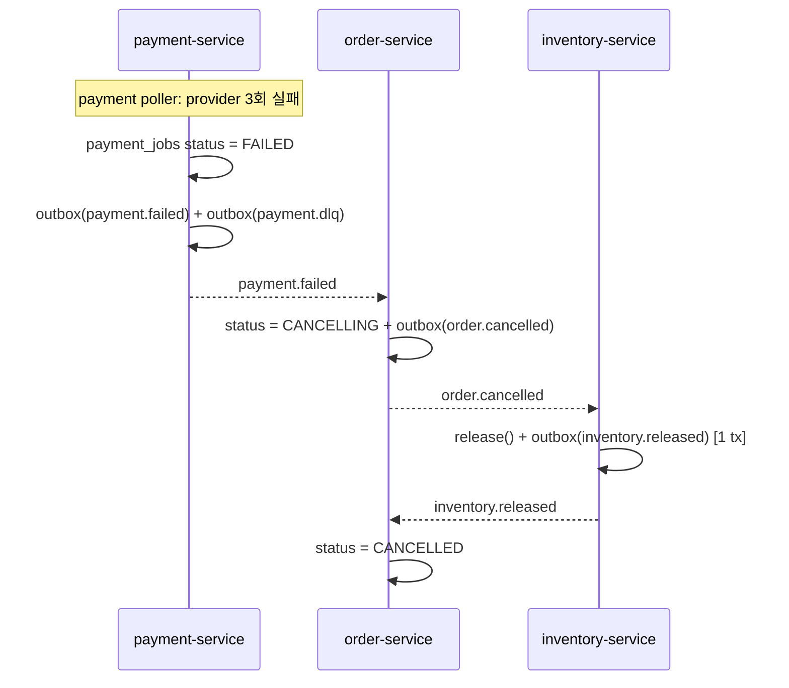

# order-pipeline-choreography 설계

- 작성일: 2026-09-08
- 상태: 설계 확정 (구현 착수 전)
- 선행 프로젝트: [`../order-pipeline`](../../../order-pipeline) — 같은 도메인을 Saga Orchestration으로 구현

### 개정 이력

- 2026-09-09: **`order-query-service` 삭제 (CQRS 읽기 분리 철회).** order-service가 이미 모든
  단계 이벤트를 구독해 자기 Order 테이블에 전체 상태를 투영하므로, 별도 읽기 모델 서비스·DB는
  중복이었다 (YAGNI). order-service가 `POST /orders` + 조회(`GET /orders`, `GET /orders/{id}`)를
  자기 DB에서 함께 제공한다. CQRS 읽기 분리는 필요가 실제로 생기면 (리치 필터/페이지네이션을
  비정규화 테이블에서, 읽기 트래픽을 write DB에서 분리) 별도 슬라이스로 추가한다.

---

## 1. 배경과 목표

선행 프로젝트 `order-pipeline`은 Kafka 기반 **Saga Orchestration**이었다. 중앙 오케스트레이터가
`commands.*`를 발행하고 각 서비스가 `events.*`로 응답하면 오케스트레이터가 다음 단계를 결정했다.

이번 프로젝트는 **같은 주문 처리 도메인을 Choreography 방식으로** 다시 구현한다. 백엔드만 작업한다.

### 학습 목표 (우선순위 순)

1. **at-least-once 전달 보장을 제대로 구현한다.** 선행 프로젝트는 `enable.auto.commit`이 켜진
   기본 설정이라 크래시 타이밍에 따라 메시지가 유실되거나 중복 처리되면 재고가 이중 차감됐다.
   이번에는 **수동 커밋 + 멱등 컨슈머(inbox) + transactional outbox**로 정면 대응한다.
2. **Choreography 실습.** 중앙 조정자 없이 각 서비스가 다른 서비스의 도메인 이벤트에 반응해서
   전체 흐름이 진행된다.
3. **Kafka 메시징 복습.** 컨슈머 그룹, 파티션, 키잉, 리밸런스, 스키마 계약, 수동 오프셋 관리.

### 부차 목표

- 선행 프로젝트의 단조로운 구조를 벗어나 **실무에 가까운 프로젝트 구조 + 헥사고날 아키텍처**.
- **풀 관측성 스택** (OpenTelemetry + Tempo + Prometheus + Grafana + Loki). 선행 프로젝트에서
  맛만 봤던 것을 이번에 제대로.

---

## 2. 비목표

- 프론트엔드, SSE, 실시간 상태 스트리밍
- Kafka 트랜잭션 / EOS (exactly-once semantics) — **일부러** 쓰지 않는다. 멱등 컨슈머와 dedup을
  직접 구현하는 것이 학습 목표이고, EOS는 그걸 다 숨긴다.
- Confluent Schema Registry, Avro — JSON Schema 파일 + CI 검증으로 대체
- 인증/인가, 멀티테넌시
- 실제 결제 연동 — mock provider
- 프로덕션 배포, Kubernetes, 멀티 브로커 / 복제

---

## 3. 아키텍처

### 3.1 서비스

| 서비스 | 책임 | DB | HTTP |
|---|---|---|---|
| `order-service` | Order 애그리거트, 주문 생명주기 상태 머신, 주문 조회 | `order-postgres` | `POST /orders`, `GET /orders`, `GET /orders/{id}` |
| `inventory-service` | 재고 예약 / 해제 | `inventory-postgres` | `GET /products` |
| `payment-service` | 결제 시도 + 재시도 (`payment_jobs`) | `payment-postgres` | — |
| `notification-service` | 알림 발송 (로그 mock) | `notification-postgres` | — |

- `order-service`는 자기 Order 테이블에 전체 상태를 유지한다. `POST /orders`로 주문을 만들고,
  이후 단계 이벤트(`inventory.reserved`, `payment.completed`, ...)를 구독해 상태를 전진시키며,
  조회(`GET /orders`)도 같은 테이블에서 제공한다. 별도 읽기 모델 서비스는 두지 않는다 (개정 이력 참조).
- `notification-service`도 멱등 컨슈머가 필요하므로 inbox 테이블용 DB를 가진다 (알림 2번 발송 금지).
- **서비스 간 비즈니스 코드 공유 없음.** 공유하는 것은 도메인 지식이 0인 전송 라이브러리
  `pipeline-kafka`(§7.2)뿐이다.

### 3.2 Choreography 원칙

- `order-service`는 **명령을 보내지 않는다.** `order.placed`, `order.cancelled` 같은 **사실(fact)**만
  발행한다. 각 서비스가 앞 서비스의 도메인 이벤트에 반응해서 다음 단계를 스스로 실행한다.
- 취소는 Order 레벨의 결정이다. 결제가 최종 실패하면 `order-service`가 `order.cancelled`를 발행하고,
  `inventory-service`가 그 사실에 반응해서 재고를 되돌린다. `order-service`가 "재고 풀어"라고
  지시하는 게 아니다.

### 3.3 토픽

애그리거트당 토픽 1개. 파티션 3개, replication factor 1, `key = order_id` (주문별 순서 보장).

| 토픽 | 이벤트 | 보존 |
|---|---|---|
| `order.events` | `order.placed`, `order.cancelled` | 7d |
| `inventory.events` | `inventory.reserved`, `inventory.reservation_rejected`, `inventory.released` | 7d |
| `payment.events` | `payment.completed`, `payment.failed` | 7d |
| `notification.events` | `notification.sent` | 7d |
| `payment.dlq` | 재시도 3회 소진된 결제 실패 이벤트 (검사용, 자동 컨슈머 없음) | 30d |

- 컨벤션: `<애그리거트>.events`는 도메인 이벤트 스트림, `<애그리거트>.dlq`는 데드레터.
  토픽명에 `.`만 쓰고 `_`는 섞지 않는다 (Kafka 메트릭 이름에서 `.`↔`_` 충돌 경고 회피).
- 토픽 auto-create는 **끈다.** `kafka-init` 원샷 컨테이너가 서비스 기동 전에
  `scripts/create-topics.sh`로 전부 생성한다. (선행 프로젝트 교훈: 존재하지 않는 토픽을 구독하면
  `UNKNOWN_TOPIC_OR_PART`가 나고 librdkafka가 재확인 주기를 5분으로 늦춘다.)

### 3.4 이벤트 봉투

```json
{
  "event_id": "b1e2...uuid",
  "event_type": "inventory.reserved",
  "occurred_at": "2026-09-08T12:00:00Z",
  "correlation_id": "<order_id>",
  "producer": "inventory-service",
  "schema_version": 1,
  "payload": { }
}
```

- `event_id` — Kafka 헤더 `message-id`로도 실린다. **중복 판별 키의 단일 출처.**
- `correlation_id` — `order_id`. Kafka 헤더 `correlation-id`, 로그·트레이스 상관에 사용.
- W3C `traceparent` 헤더도 함께 실려서 서비스 경계를 넘는 트레이스가 이어진다.
- 봉투 모델은 `pipeline-kafka`가 정의한다. `payload` 스키마는 서비스별로 `contracts/`에서 관리.

### 3.5 이벤트 카탈로그 (payload)

| 이벤트 | payload |
|---|---|
| `order.placed` | `{ order_id, items: [{sku, qty}], card_number, amount }` |
| `inventory.reserved` | `{ order_id }` |
| `inventory.reservation_rejected` | `{ order_id, reason }` |
| `inventory.released` | `{ order_id }` |
| `payment.completed` | `{ order_id, payment_id }` |
| `payment.failed` | `{ order_id, reason, attempts }` |
| `order.cancelled` | `{ order_id, reason }` |
| `notification.sent` | `{ order_id, channel }` |

정본 JSON Schema는 `contracts/*.json`. 각 서비스는 자기 Pydantic 모델을 정의하고, CI에서 그 모델의
직렬화 결과가 스키마를 통과하는지 pytest로 검증한다.

---

## 4. Choreography 흐름

### 4.1 해피패스



`order-service`가 자기 단계 이벤트 외에 다른 서비스의 이벤트도 구독해 Order 상태를 전진시킨다
(상태 전이 순서 가드, §5.8). `GET /orders/{id}`는 이 테이블을 읽는다.

### 4.2 재고 부족 (보상 불필요)

```
inventory-service ← order.placed → reserve() 실패
                  → outbox(inventory.reservation_rejected)
order-service ← inventory.reservation_rejected → status = CANCELLED
(하류에서 일어난 일이 없으므로 되돌릴 것이 없다)
```

### 4.3 결제 최종 실패 + 보상



재고 부족과 결제 실패는 **비대칭**이다. 재고 부족은 재시도해도 결과가 같으므로 즉시 취소하고,
결제 실패만 일시적 오류로 보고 재시도 대상으로 삼는다 (선행 프로젝트 설계 계승).

---

## 5. at-least-once 설계

### 5.1 핵심 원칙

모든 소비 핸들러는 **단일 DB 트랜잭션** 안에서:

1. inbox 중복 체크 (INSERT, PK 충돌 시 중복)
2. 도메인 상태 변경
3. 결과 이벤트 outbox 삽입

을 수행하고, **트랜잭션 커밋이 성공한 뒤에만** Kafka 오프셋을 수동 커밋한다.

### 5.2 소비 경로

```
consumer.poll()
 → traceparent 추출, consume 스팬 시작
 → BEGIN tx
     INSERT inbox(message_id, consumer_group)     -- PK 충돌 → 중복, 도메인 skip
     도메인 로직 (repo write)
     INSERT outbox(...)                            -- 결과 이벤트
   COMMIT tx
 → consumer.commit(message)                        -- 오프셋, tx 밖
```

### 5.3 크래시 매트릭스

| 크래시 시점 | 재기동 시 | 결과 |
|---|---|---|
| poll 후, tx 시작 전 | 오프셋 미커밋 → 재수신 | inbox 행 없음 → 정상 1회 처리 |
| tx 커밋 전 | tx 롤백, 오프셋 미커밋 → 재수신 | 정상 1회 처리 |
| tx 커밋 후, 오프셋 커밋 전 | 오프셋 미커밋 → 재수신 | inbox PK 충돌 → 도메인 skip, 오프셋만 커밋. **이중 효과 없음** |
| outbox 발행 후, `published_at` 마킹 전 | outbox 폴러 재실행 | 이벤트 재발행 → 하류 inbox가 흡수 |

결과: at-least-once **전달** + 멱등 **효과** = 효과적 exactly-once.

### 5.4 멱등 컨슈머 (inbox)

```sql
CREATE TABLE inbox (
    message_id     UUID        NOT NULL,
    consumer_group TEXT        NOT NULL,
    handled_at     TIMESTAMPTZ NOT NULL DEFAULT now(),
    PRIMARY KEY (message_id, consumer_group)
);
```

- `consumer_group`을 PK에 포함: 같은 이벤트를 여러 서비스가 소비하므로 각자 독립적으로 dedup.
- 소비하는 **모든** 서비스가 inbox를 가진다 (notification 포함).
- 정리: `handled_at < now() - interval '7 days'` 행을 주기적으로 삭제하는 배치 태스크.
  `# ponytail: 단순 시간 기준 배치 삭제, 테이블이 커지면 파티셔닝`

### 5.5 Transactional outbox

```sql
CREATE TABLE outbox (
    id             BIGSERIAL   PRIMARY KEY,
    topic          TEXT        NOT NULL,
    key            TEXT        NOT NULL,
    headers        JSONB       NOT NULL,
    payload        JSONB       NOT NULL,
    created_at     TIMESTAMPTZ NOT NULL DEFAULT now(),
    published_at   TIMESTAMPTZ,
    next_attempt_at TIMESTAMPTZ NOT NULL DEFAULT now()
);
```

- **폴링 발행기.** 서비스마다 백그라운드 asyncio 태스크가:
  ```sql
  SELECT * FROM outbox
   WHERE published_at IS NULL AND next_attempt_at <= now()
   ORDER BY id LIMIT :batch
   FOR UPDATE SKIP LOCKED
  ```
  → Kafka produce → 브로커 ack 시 `published_at = now()`.
- 단일 폴러 / 서비스, `id` 순 → 애그리거트 내 순서 유지.
- 발행 실패 시 `next_attempt_at`을 지수 백오프로 미룬다.
- 도메인 write와 outbox insert가 **같은 트랜잭션** → dual write 없음. 선행 프로젝트의
  "재고는 깠는데 이벤트 발행 전 크래시" 구멍을 메운다.
- Debezium CDC는 쓰지 않는다 — Kafka Connect 인프라가 붙어 무겁다. 폴러는 ~30줄이고 패턴 학습에 충분.

### 5.6 수동 커밋 + 리밸런스

- `enable.auto.commit = false`, `auto.offset.reset = earliest`
- `on_revoke` 콜백: 파티션을 반납하기 직전 지금까지 처리한 오프셋을 커밋
- `on_assign`: 특별 처리 없음 (오프셋은 브로커에 저장)

### 5.7 payment 재시도 (jobs 패턴)

```sql
CREATE TABLE payment_jobs (
    order_id       TEXT        PRIMARY KEY,
    status         TEXT        NOT NULL,   -- PENDING | DONE | FAILED
    attempts       INT         NOT NULL DEFAULT 0,
    next_attempt_at TIMESTAMPTZ NOT NULL DEFAULT now(),
    card_number    TEXT        NOT NULL,
    amount         NUMERIC     NOT NULL,
    ...
);
```

- `inventory.reserved` 수신 시, 컨슈머는 `payment_jobs` 행만 생성한다 (inbox 보호).
- 별도 폴러가 `status = PENDING AND next_attempt_at <= now()` job을 처리:
  - provider 성공 → `status = DONE`, `outbox(payment.completed)`
  - provider 실패, `attempts < 3` → `attempts++`, `next_attempt_at = now() + backoff(attempts)`
  - `attempts == 3` → `status = FAILED`, `outbox(payment.failed)` + `outbox(payment.dlq)`
- "메시지 수신"과 "결제 N회 시도"를 분리 → 재시도가 컨슈머를 블로킹하지 않고, 백오프가
  도메인 개념이 되며, 테스트가 쉽다.

### 5.8 상태 전이 순서 가드

`order-service`는 여러 토픽(`inventory.events`, `payment.events`, `notification.events`)을 구독하므로
같은 `order_id`라도 애그리거트가 다르면 이벤트가 컨슈머에서 교차 도착할 수 있다.

- 상태 우선순위: `PLACED(0) < RESERVED(1) < PAID(2) < COMPLETED(3)`, `CANCELLED(99, 종결)`
- 상태 전이 시 들어온 상태의 우선순위가 현재 이하이면 무시한다 (늦게 도착한 이벤트).
- 표시용 타임스탬프는 이벤트의 `occurred_at`을 쓴다.
- 가정: **준선형 사가** (분기 최소). `# ponytail: 상태 우선순위 가드, 사가가 복잡해지면 이벤트 소싱 fold로`

---

## 6. 관측성

### 6.1 파이프라인

각 서비스가 OTel SDK(traces + metrics)로 OTLP를 내보내고, 구조적 JSON 로그를 stdout에 쓴다.
`otel-collector`가 OTLP를 수신해서 라우팅한다:

```
service (OTel SDK) ──OTLP──> otel-collector ──> Tempo      (traces)
                                           ├──> Prometheus (metrics)
service (JSON stdout) ──> Promtail ────────┴──> Loki       (logs)
```

Grafana가 단일 창. 서비스는 백엔드를 모르고 OTLP 엔드포인트만 안다 (헥사고날 결).

### 6.2 트레이싱

- consume / produce 경계에 수동 스팬. Kafka 헤더에 W3C `traceparent` 전파.
- 한 주문의 `order.placed → inventory.reserved → payment.completed → notification.sent`가
  **하나의 인과 트레이스**로 이어진다. Choreography를 눈으로 보고 디버깅하는 핵심 도구.
- 계측은 `pipeline-kafka` 어댑터에 위치하고 **Slice 0부터** 들어간다.

### 6.3 메트릭 (OTel SDK → Prometheus)

| 메트릭 | 종류 | 라벨 |
|---|---|---|
| `messages_consumed_total` | counter | `service, topic, event_type, result=processed\|deduped\|error` |
| `message_handler_duration_seconds` | histogram | `service, event_type` |
| `outbox_pending` | gauge | `service` |
| `outbox_relay_lag_seconds` | gauge | `service` (now − 가장 오래된 미발행 `created_at`) |
| `payment_attempts_total` | counter | `result` |
| `dlq_messages_total` | counter | `topic` |
| `order_e2e_duration_seconds` | histogram | — (`order-service`가 종결 전이 시 방출) |

컨슈머 lag은 Collector의 `kafkametrics` receiver로 수집.

### 6.4 로그 (Promtail → Loki)

- 구조적 JSON stdout. 모든 줄에 `trace_id`, `span_id`, `correlation_id`(order_id), `service`, `event_type`.
- 전달 생명주기 로깅: `received` / `deduped` / `processed` / `committed` / `produced`.
- OTLP 로그(SDK)는 쓰지 않는다 — Python OTel-logs SDK가 덜 성숙. 필드 주입으로 상관관계를 확보한다.

### 6.5 상관관계 + Grafana as code

- Prometheus **exemplars**: 히스토그램 샘플에 `trace_id`를 붙여 패널에서 트레이스로 점프.
- Grafana **derived fields**: Loki `trace_id` → Tempo, Tempo span → Loki 로그.
- 프로비저닝: datasource(Prometheus / Loki / Tempo) + 대시보드 JSON을 `observability/grafana/`에 커밋.
- 대시보드 3개:
  1. **파이프라인 개요** — 처리량, dedup율, DLQ 카운트, e2e 지연 분포, outbox lag
  2. **서비스별 컨슈머 헬스** — 파티션 lag, 핸들러 지연, 에러율
  3. **at-least-once 드릴** — 크래시 테스트 중 재처리 / 중복 흡수 관측

---

## 7. 레포 레이아웃

### 7.1 디렉터리

```
order-pipeline-choreography/
├── contracts/                  # JSON Schema — 정본 이벤트 payload 스키마
├── libs/
│   └── pipeline-kafka/         # 도메인 없는 전송 라이브러리 (독립 pyproject)
├── services/
│   ├── order-service/
│   ├── inventory-service/
│   ├── payment-service/
│   └── notification-service/
├── observability/
│   ├── otel-collector/         # collector config
│   ├── prometheus/
│   ├── tempo/
│   ├── loki/
│   └── grafana/                # datasource + dashboard 프로비저닝
├── scripts/                    # create-topics.sh 등
├── docker-compose.yaml
└── docs/specs_plans/
```

- repo 루트에 `uv` workspace를 두어 `libs/*`와 `services/*`를 묶는다.
- 서비스는 `pipeline-kafka`를 path 의존으로 참조. Docker 빌드 시 lib을 이미지 컨텍스트에 복사.

### 7.2 `pipeline-kafka` (도메인 지식 0)

- 컨슈머 런타임: poll 루프, inbox 체크, tx 경계, 수동 커밋, `on_revoke` 훅
- 프로듀서 래퍼
- inbox / outbox 어댑터 + outbox 폴러
- OTel 배선: consume/produce 스팬, `traceparent` 전파, 메트릭 헬퍼
- 이벤트 봉투 모델 (§3.4)

**불포함**: 도메인 엔티티, 이벤트 payload 스키마, 비즈니스 규칙. "서비스 간 코드 공유 없음" 규칙은
비즈니스 결합이 대상이다. 도메인 없는 전송 계층은 프레임워크가 주는 것과 동일하다.

### 7.3 서비스 내부 (헥사고날)

```
services/<service>/src/<service>/
├── domain/         # 순수: 엔티티, 값 객체, 도메인 이벤트, 규칙 (프레임워크 import 0)
├── application/    # 유스케이스 핸들러, 포트(Protocol 인터페이스), UnitOfWork
├── adapters/
│   ├── inbound/    # kafka consumer 구성, FastAPI route
│   └── outbound/   # kafka producer, SQLAlchemy repo, outbox
└── composition.py  # 수동 조립 (DI 프레임워크 없음)
```

### 7.4 트랜잭션 경계 / UnitOfWork

- 메시지 1건 = SQLAlchemy async 세션 1개 = DB 트랜잭션 1개.
- `application` 계층의 얇은 `UnitOfWork`가 repo + inbox + outbox를 보유한다. 핸들러는 세션을
  직접 만지지 않는다 (세션은 adapter 디테일).
- outbox 폴러는 배치마다 별도 세션 / 트랜잭션.
- Kafka 오프셋 커밋은 **반드시** 트랜잭션 커밋 이후.

### 7.5 스택

선행 프로젝트와 동일 (복습이 목표):

| 영역 | 스택 |
|---|---|
| 메시징 | Apache Kafka (KRaft, 단일 브로커), `confluent-kafka-python` |
| 서비스 | FastAPI, SQLAlchemy 2.0 (async), asyncpg, Alembic (서비스별) |
| 관측성 | OpenTelemetry SDK, otel-collector, Tempo, Prometheus, Grafana, Loki, Promtail |
| 인프라 | Docker Compose |
| 테스트 | pytest, pytest-asyncio, Testcontainers |

---

## 8. 테스트 전략

- **통합 우선.** Testcontainers(Kafka + Postgres) + `pytest-asyncio`. 테스트가 스펙 역할.
- `domain/` 계층은 컨테이너 없는 순수 유닛 테스트.
- **크래시 주입.** 핸들러가 읽는 `CRASH_AT` 환경변수:
  `after_inbox_before_commit`, `after_commit_before_offset`, `outbox_after_produce_before_mark`.

### 필수 시나리오

| # | 시나리오 | 기대 |
|---|---|---|
| 1 | 같은 `event_id` 2회 전달 | 효과 1회 |
| 2 | tx 커밋 후 오프셋 커밋 전 크래시 | 재처리, 이중 효과·유실 없음 |
| 3 | outbox 폴러 produce 후 mark 전 크래시 | 이벤트 재발행, 하류 dedup |
| 4 | 리밸런스 (컨슈머 2개, 1개 kill) | `on_revoke` 커밋, 유실·중복 없음 |
| 5 | 해피패스 E2E | `order.status = COMPLETED` |
| 6 | 결제 3회 실패 | `inventory.released`, `order.status = CANCELLED` |

### Mock payment provider

- `PaymentProvider` 포트 + `MockPaymentProvider` 어댑터.
- 카드번호로 결정적 분기 (Stripe 테스트 카드 스타일):
  - `4000000000000002` → 항상 실패
  - `4000000000000341` → 2회 실패 후 성공
  - 그 외 → 성공
- 랜덤 실패 없음 (비결정적 테스트 회피).

---

## 9. 트레이서 불릿 슬라이스

각 슬라이스는 실행 가능해야 하고, 실패하는 테스트부터 작성한다 (red → green → refactor).

| Slice | 내용 |
|---|---|
| **0** | **워킹 스켈레톤 (발행 경로).** `order-service POST /orders` → Order(PLACED) + outbox [1 tx] → 폴러 → `order.events`로 `order.placed` 발행. `GET /orders/{id}` = PLACED (자기 DB, 동기). outbox, 수동 오프셋 없음(아직 컨슈머 없음), UnitOfWork, OTel 트레이싱(Collector + Tempo), alembic, docker-compose 관통. 검증: GET이 PLACED, `order.placed`가 Kafka에 도착, produce 스팬이 트레이스에 보임. **inbox·컨슈머 런타임은 Slice 1로.** |
| **1** | 컨슈머 런타임 + inbox 도입. `inventory-service`가 `order.placed`에 반응 → `inventory.reserved` / `inventory.reservation_rejected`. `order-service`가 `inventory.events`를 구독해 상태 전진. 여기서 produce→consume 트레이스 체인이 처음 이어짐. |
| **2** | `payment-service` — `payment_jobs` + 폴러 + 지수 백오프 → `payment.completed` / `payment.failed`, `payment.dlq` 적재. |
| **3** | 보상 + 완료 — `order.cancelled` → `inventory` release, `notification-service` → `notification.sent` → COMPLETED. |
| **4** | 관측성 풀 — OTel 메트릭 → Prometheus, 로그 → Promtail → Loki, Grafana 대시보드 3개, exemplar / derived field 상관. |
| **5** | 경화 — `CRASH_AT` 훅 + 크래시 주입 테스트 + 리밸런스 테스트 + at-least-once 드릴 대시보드. |

---

## 10. 가정과 열린 질문

### 가정

- **준선형 사가.** order-service의 상태 전이 순서 가드(§5.8)가 이 가정에 의존한다. 분기가 많아지면
  이벤트 소싱 fold를 재고한다.
- 카드번호를 `order.placed` payload에 평문으로 싣는다. **학습 단순화** — 실무는 PSP 토큰화,
  이벤트에 절대 싣지 않는다. `# ponytail:` 주석으로 표시.
- Kafka 단일 브로커, RF 1. 로컬 학습용이며 브로커 장애 내성은 범위 밖.
- `notification-service`의 채널은 로그 출력 mock.
- inbox / outbox 정리는 단순 시간 기준 배치 삭제.

### 열린 질문 (구현하며 결정)

- `payment_jobs` 폴러와 outbox 폴러를 한 태스크로 합칠지, 분리 유지할지.
- `order-service`가 `CANCELLING` 중간 상태를 persist할지, 아니면 `payment.failed` 수신 즉시
  `order.cancelled`를 발행하고 바로 `CANCELLED`로 갈지.
- `pipeline-kafka`의 outbox 폴러를 라이브러리가 태스크로 띄워줄지, 서비스 `composition.py`가
  띄우고 라이브러리는 함수만 제공할지.
